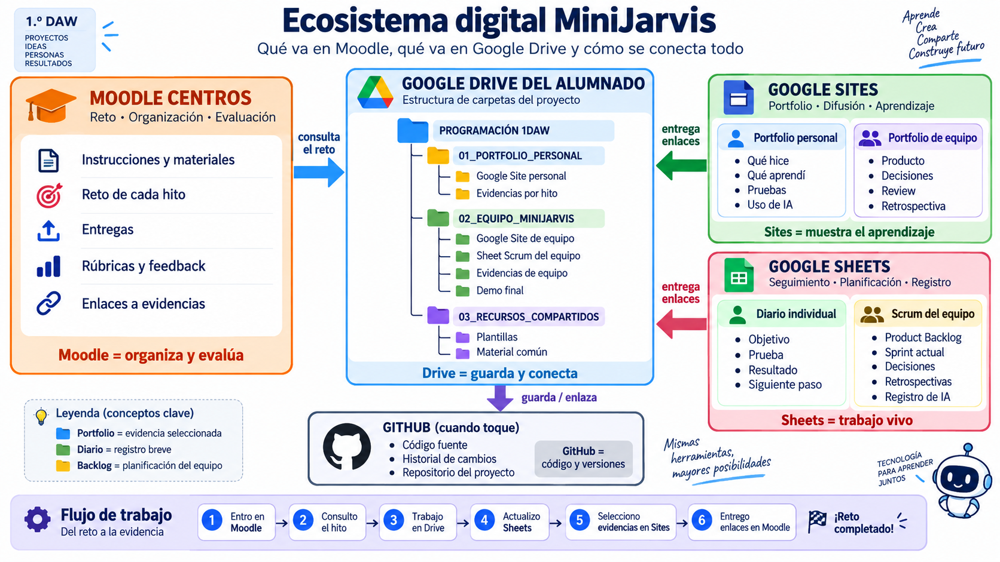

# Ecosistema digital docente — MiniJarvis

## Orden de uso

1. `01-arquitectura-y-responsabilidades.md`
2. `02-estructura-drive-5-equipos.md`
3. `03-permisos-propiedad-y-continuidad.md`
4. `04-protocolo-entrega-y-congelacion.md`
5. `05-despliegue-sheets-sites-y-github.md`
6. `TAREAS-MOODLE/`
7. `PLANTILLAS-MAESTRAS/`
8. `CHECKLIST-PUESTA-EN-MARCHA.md`

El profesorado administra inicialmente la carpeta maestra, crea los documentos estructurales y mantiene fuera de ella cualquier observación privada.

## Diagrama de referencia

