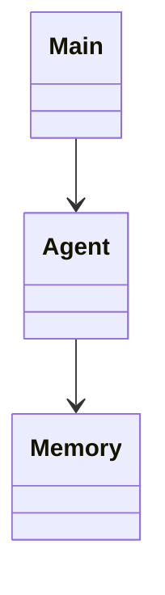

# H4 — Agente orientado a objetos

> Ejemplo privado de Laura. Mostrar solo después del intento propio del alumnado.

## Objetivo

Separar responsabilidades mediante objetos.

## Arquitectura de evidencias

Versión estable: `h4-entrega`. El repositorio y su README son la evidencia técnica canónica.

- Diario individual evolutivo: `../FUENTES-CURSO/01-Diario-individual-MiniJarvis.xlsx`.
- Scrum de equipo evolutivo: `../FUENTES-CURSO/02-Scrum-equipo-MiniJarvis.xlsx`.
- Entrega Moodle mínima: `../ENTREGAS-MOODLE/H4-entrega.md`.

## Diseño de clases [EQUIPO]

El diagrama de clases forma parte del README. El diagrama de comportamiento es práctica coordinada opcional de Entornos, no entrega obligatoria de Programación.

## Decisión y resultado

- Decisión: Main inicia, Agent coordina y Memory conserva recuerdos.
- Resultado probado: El comportamiento anterior se conserva con un diseño más claro.

## Defensa de Laura [INDIVIDUAL]

Laura localiza su aportación, reproduce una prueba y explica una decisión sin apoyarse en una plantilla de defensa separada.
