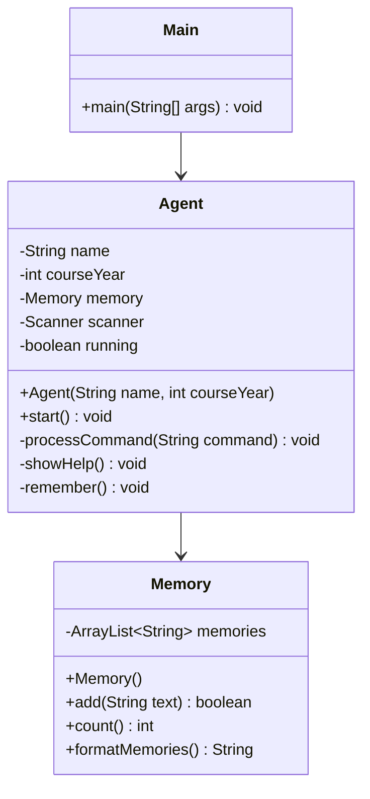
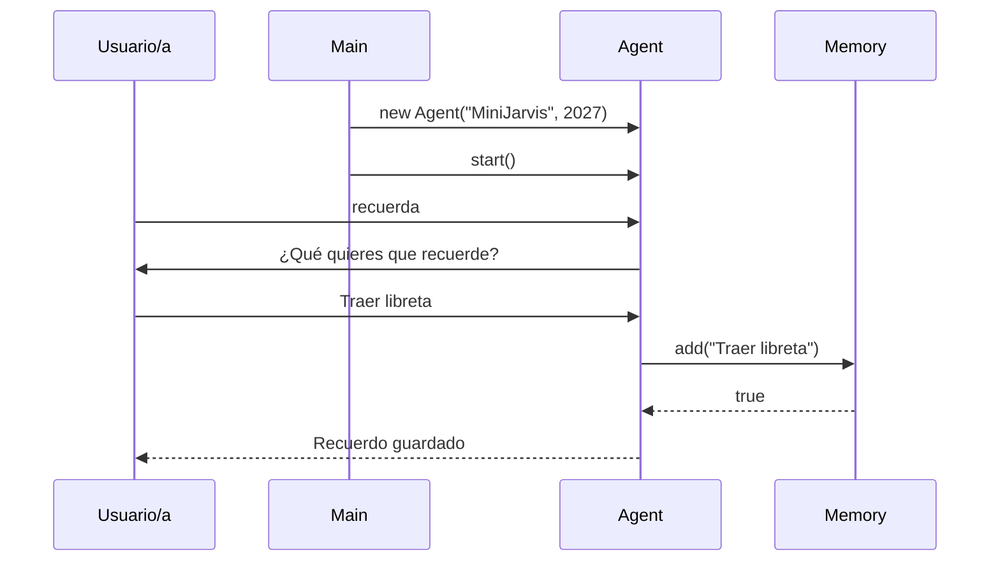

# Guía docente completa — H4 sesión a sesión

## Agente orientado a objetos — MiniJarvis H4

## Programación + Entornos de Desarrollo — 1.º DAW — Curso 2026/2027

Versión: borrador 0.1

Documento autónomo para uso del profesorado.

Este documento permite impartir H4 completo sin abrir ningún otro material durante la clase.

---

## 1. Propósito de H4

H4 rediseña MiniJarvis aplicando programación orientada a objetos.

Producto final:

```text
MiniJarvis H4: agente por consola organizado en clases propias, con responsabilidades claras, encapsulación básica, diagramas y defensa de diseño.
```

H4 introduce:

```text
- problema de Main demasiado grande;
- clase, objeto, atributo, método y constructor;
- extracción de Memory;
- extracción de Agent;
- private/public;
- diagrama de clases;
- diagrama de comportamiento;
- relación diagrama-código;
- comparación Java ↔ Python;
- defensa oral H4.
```

Idea docente central:

```text
H4 no consiste en escribir más código, sino en ordenar el código para que cada clase tenga una responsabilidad defendible.
```

---

## 2. Restricciones de H4

En H4 sí entra:

```text
[x] Clases propias.
[x] Objetos creados con new.
[x] Atributos.
[x] Métodos.
[x] Constructor.
[x] Visibilidad private/public.
[x] Separación Main / Agent / Memory.
[x] Diagrama de clases.
[x] Diagrama de comportamiento.
[x] Relación entre diagramas y código real.
[x] Comparación sencilla Java ↔ Python.
[x] Defensa de responsabilidades.
```

En H4 todavía NO entra:

```text
[ ] Patrones de diseño obligatorios.
[ ] Interfaces complejas.
[ ] Plugins.
[ ] Arquitectura avanzada.
[ ] Persistencia en ficheros.
[ ] Base de datos.
[ ] API externa.
[ ] IA real.
```

Frase docente:

```text
H4 es el hito de ordenar responsabilidades. Si alguien añade patrones, ficheros o plugins antes de poder defender Agent y Memory, se está adelantando al objetivo.
```

---

## 3. Diseño mínimo de referencia

Clases mínimas:

| Clase | Responsabilidad |
|---|---|
| `Main` | Arrancar el programa y delegar en `Agent`. |
| `Agent` | Gestionar interacción, comandos y flujo principal. |
| `Memory` | Guardar y mostrar recuerdos temporales. |

Regla de aula:

```text
Main no decide casi nada.
Agent coordina.
Memory recuerda.
```

Estructura esperada:

```text
h4-agente-orientado-objetos/
├── README.md
├── src/
│   ├── Main.java
│   ├── Agent.java
│   └── Memory.java
└── docs/
    ├── diagrama-clases-h4.md
    ├── diagrama-comportamiento-h4.md
    ├── relacion-diagrama-codigo-h4.md
    ├── comparacion-java-python-h4.md
    ├── portfolio-h4.md
    ├── registro-ia.md
    └── defensa-h4.md
```

Código orientativo mínimo para explicar la meta, no para copiar sin entender:

```java
public class Main {
    public static void main(String[] args) {
        Agent agent = new Agent("MiniJarvis", 2027);
        agent.start();
    }
}
```

```java
public class Agent {
    private String name;
    private int courseYear;
    private Memory memory;

    public Agent(String name, int courseYear) {
        this.name = name;
        this.courseYear = courseYear;
        this.memory = new Memory();
    }

    public void start() {
        System.out.println("Hola, soy " + name + " H4.");
    }
}
```

```java
import java.util.ArrayList;

public class Memory {
    private ArrayList<String> memories;

    public Memory() {
        this.memories = new ArrayList<>();
    }

    public boolean add(String text) {
        if (text == null || text.trim().isEmpty()) {
            return false;
        }
        memories.add(text.trim());
        return true;
    }

    public int count() {
        return memories.size();
    }
}
```

---

## 4. Secuencia de sesiones H4

Preparación docente antes de iniciar H4:

```text
1. Tener localizado un ejemplo de H3 con Main cargado de responsabilidades.
2. Recordar que no se evalúa todavía arquitectura avanzada, sino comprensión básica de POO.
3. Preparar una explicación breve de clase, objeto, atributo, método y constructor con el propio MiniJarvis.
4. Decidir si el grupo trabajará individualmente o por parejas, manteniendo defensa individual.
5. Reservar tiempo en cada sesión para que el alumnado escriba una evidencia breve, no solo código.
6. Insistir desde el primer día en que el diagrama se construye desde el código real y se corrige cuando el código cambia.
7. Mantener visible la regla: Main arranca, Agent coordina, Memory recuerda.
```

Material mínimo de aula:

```text
- editor o IDE Java;
- terminal para compilar y ejecutar;
- cuaderno o portfolio digital;
- pizarra para responsabilidades;
- posibilidad de escribir diagramas en texto, Mermaid o dibujo simple;
- registro de uso de IA si se permite apoyo.
```

Propuesta de 10 sesiones de 45 minutos.

| Sesión | Foco | Producto parcial |
|---|---|---|
| H4-S1 | Presentar el problema de `Main` demasiado grande | Diagnóstico de responsabilidades mezcladas. |
| H4-S2 | Clase, objeto, atributo, método y constructor | Vocabulario POO aplicado a MiniJarvis. |
| H4-S3 | Extraer `Memory` | Clase `Memory` con atributo privado y constructor. |
| H4-S4 | Usar `Memory` desde el programa | Métodos `add`, `count` y consulta básica. |
| H4-S5 | Extraer `Agent` | Clase `Agent` que coordina comandos. |
| H4-S6 | Encapsulación `private`/`public` | Revisión de visibilidad y responsabilidades. |
| H4-S7 | Diagrama de clases | Diagrama con `Main`, `Agent` y `Memory`. |
| H4-S8 | Diagrama de comportamiento | Flujo de arranque, recordar y consultar. |
| H4-S9 | Relación diagrama-código y comparación Java ↔ Python | Documento de trazabilidad + comparación. |
| H4-S10 | Defensa H4 | Revisión, defensa y cierre del hito. |

---

# H4-S1 — Presentar el problema de Main demasiado grande

## Duración

```text
45 minutos
```

## Objetivo

Que el alumnado detecte por qué un `Main` que lo hace todo se vuelve difícil de entender, mantener, probar y defender.

## Resultado esperado

Cada alumno/a debe producir un diagnóstico breve:

```text
En mi H3, Main hace estas responsabilidades:
1. ...
2. ...
3. ...
Responsabilidades que podrían separarse:
- memoria;
- interacción/comandos;
- arranque.
```

## Guion docente

```text
Hasta H3 hemos aceptado que MiniJarvis creciera dentro de Main porque necesitábamos aprender entrada, salida, condicionales, bucles y colecciones.

Ahora aparece un problema profesional: Main empieza a saber demasiado y a hacer demasiadas cosas.

Cuando una parte del programa hace demasiadas cosas, cualquier cambio rompe más fácilmente el resto. H4 empieza justo aquí: separar responsabilidades.
```

## Pizarra

```text
Problema H3:
Main = arranca + saluda + lee comandos + decide + recuerda + muestra + valida

Objetivo H4:
Main = arranca
Agent = coordina
Memory = recuerda
```

## Qué explicas tú

```text
- Qué significa responsabilidad en programación.
- Por qué un método o clase demasiado grande dificulta depurar.
- Que POO no es decorar el código con clases, sino repartir responsabilidades.
- Que el producto debe seguir haciendo lo mismo que H3, pero mejor organizado.
```

## Actividad HEXA guiada

### H — Hecho o situación

Presentas un `Main` cargado de responsabilidades:

```java
public class Main {
    public static void main(String[] args) {
        // saluda
        // crea scanner
        // crea ArrayList
        // muestra menú
        // procesa comandos
        // valida entradas
        // guarda recuerdos
        // muestra recuerdos
        // decide salir
    }
}
```

### E — Explorar

Pregunta al grupo:

```text
¿Qué partes de este Main parecen pertenecer a temas diferentes?
```

Opciones esperadas:

```text
- arranque del programa;
- conversación con el usuario;
- memoria;
- validación;
- menú;
- salida.
```

### X — eXplicar

El alumnado formula una explicación:

```text
Main es demasiado grande porque mezcla varias responsabilidades.
```

### A — Aplicar

Marcan con colores o etiquetas qué líneas serían de arranque, agente y memoria.

## Actividad

Trabajo individual o por parejas:

```text
1. Abrir el código H3 propio.
2. Sin modificar todavía, escribir una lista de responsabilidades que hace Main.
3. Clasificarlas en tres grupos: Main, Agent, Memory.
4. Señalar una línea o fragmento que debería moverse en H4.
```

Si alguien no tiene H3 terminado, puede trabajar con este caso mínimo:

```text
Main saluda, muestra un menú, guarda recuerdos en una lista y permite verlos.
```

## Errores frecuentes

| Error | Señal | Intervención docente |
|---|---|---|
| Querer reescribir todo desde cero | Borran H3 antes de diagnosticar | Pedir primero mapa de responsabilidades. |
| Pensar que H4 añade funciones nuevas | Quieren IA real o ficheros | Reencuadrar: mismo comportamiento, mejor diseño. |
| Crear muchas clases sin motivo | Proponen `MenuManager`, `UserInput`, `Brain`, etc. | Volver a tres clases mínimas. |
| No saber qué es responsabilidad | Responden con líneas sueltas | Preguntar: “¿qué sabe?” y “¿qué hace?”. |

## Cierre

Ticket de salida:

```text
1. ¿Por qué Main no debería hacerlo todo?
2. Escribe una responsabilidad que moverías a Memory.
3. Escribe una responsabilidad que moverías a Agent.
```

## Criterio de éxito

```text
El alumnado identifica al menos tres responsabilidades mezcladas en Main y entiende que H4 no busca más funcionalidad, sino mejor organización.
```

---

# H4-S2 — Clase, objeto, atributo, método y constructor

## Duración

```text
45 minutos
```

## Objetivo

Construir el vocabulario básico de POO usando MiniJarvis como contexto: clase, objeto, atributo, método y constructor.

## Resultado esperado

Ficha breve con definiciones aplicadas:

```text
Clase:
Objeto:
Atributo:
Método:
Constructor:
Ejemplo en MiniJarvis:
```

## Guion docente

```text
Antes de mover código, necesitamos un idioma común.

Una clase es un molde. Un objeto es una instancia concreta de ese molde. Un atributo guarda estado. Un método representa una acción o comportamiento. Un constructor prepara el objeto cuando nace.

No vamos a memorizar definiciones abstractas: vamos a usarlas para entender Agent y Memory.
```

## Pizarra

```text
Clase       -> el molde: Agent
Objeto      -> un agente concreto: new Agent("MiniJarvis", 2027)
Atributo    -> dato interno: name, memory
Método      -> acción: start(), add()
Constructor -> preparación inicial: public Agent(...)
```

## Qué explicas tú

```text
- La diferencia entre clase y objeto.
- Que un atributo no debería ser una variable pública sin control.
- Que un método debe tener un nombre que exprese una acción.
- Que el constructor deja el objeto en un estado inicial válido.
- Que `new` crea objetos en Java.
```

## Actividad HEXA guiada

### H — Hecho

MiniJarvis necesita recordar información.

### E — Explorar

Pregunta:

```text
Si Memory fuera una clase, ¿qué datos tendría y qué acciones permitiría?
```

### X — eXplicar

Respuestas esperadas:

```text
Datos: lista de recuerdos.
Acciones: añadir recuerdo, contar recuerdos, mostrar recuerdos.
```

### A — Aplicar

El alumnado completa:

```text
Clase: Memory
Atributo: memories
Constructor: crea la lista vacía
Métodos: add, count, formatMemories
```

## Mini explicación con código

```java
public class Memory {
    private ArrayList<String> memories;

    public Memory() {
        this.memories = new ArrayList<>();
    }

    public int count() {
        return memories.size();
    }
}
```

Preguntas durante la explicación:

```text
¿Qué parte es la clase?
¿Qué parte es atributo?
¿Qué parte es constructor?
¿Qué parte es método?
¿Qué objeto se creará cuando hagamos new Memory()?
```

## Actividad

El alumnado clasifica elementos:

| Elemento | Clase / Objeto / Atributo / Método / Constructor |
|---|---|
| `Agent` | |
| `new Agent("MiniJarvis", 2027)` | |
| `name` | |
| `start()` | |
| `public Agent(String name, int courseYear)` | |
| `memory.add(text)` | |

## Errores frecuentes

| Error | Señal | Intervención docente |
|---|---|---|
| Confundir clase y objeto | “Agent es el agente concreto” | Usar molde/galleta o plano/casa. |
| Llamar método a cualquier línea | No distinguen acción de dato | Preguntar si tiene paréntesis y qué acción realiza. |
| Constructor entendido como método normal | Esperan tipo de retorno | Señalar nombre igual a la clase y sin `void`. |
| Atributos públicos por comodidad | Usan `public ArrayList` | Anunciar que H4 exige encapsulación. |

## Cierre

Ticket:

```text
1. Define clase con tus palabras.
2. ¿Qué crea `new Memory()`?
3. ¿Para qué sirve un constructor?
```

## Criterio de éxito

```text
El alumnado usa correctamente el vocabulario básico y puede señalar esos elementos en un fragmento Java real.
```

---

# H4-S3 — Extraer Memory

## Duración

```text
45 minutos
```

## Objetivo

Extraer la memoria temporal de H3 a una clase `Memory` con responsabilidad clara.

## Resultado esperado

Archivo `src/Memory.java` creado con:

```text
- atributo privado para la colección;
- constructor que inicializa la colección;
- método para añadir recuerdo;
- método para contar recuerdos;
- método para mostrar o formatear recuerdos.
```

## Guion docente

```text
Vamos a hacer la primera extracción real: todo lo relacionado con recuerdos se mueve a Memory.

Memory no debe saber del menú completo. Memory no debe decidir cuándo termina el programa. Memory solo sabe guardar, contar y devolver recuerdos.
```

## Pizarra

```text
Memory sabe:
- qué recuerdos hay;
- cómo añadir uno válido;
- cuántos hay;
- cómo prepararlos para mostrarlos.

Memory NO sabe:
- qué opción del menú se ha escrito;
- quién es el usuario;
- cuándo termina el programa.
```

## Qué explicas tú

```text
- Cómo crear un archivo Java por clase pública.
- Por qué el nombre del archivo debe coincidir: Memory.java.
- Por qué `memories` es private.
- Por qué el constructor crea la lista vacía.
- Por qué `add` puede devolver boolean para indicar éxito o fallo.
```

## Actividad HEXA guiada

### H — Hecho

En H3 la lista estaba en `Main`:

```java
ArrayList<String> memories = new ArrayList<>();
```

### E — Explorar

Pregunta:

```text
¿Qué operaciones hacemos siempre sobre esa lista?
```

Respuestas esperadas:

```text
- crearla;
- añadir;
- comprobar si está vacía;
- contar;
- recorrer;
- mostrar.
```

### X — eXplicar

Conclusión:

```text
Si varias operaciones pertenecen a la memoria, deben vivir cerca de la memoria.
```

### A — Aplicar

Construyen `Memory.java` paso a paso.

## Código base guiado

```java
import java.util.ArrayList;

public class Memory {
    private ArrayList<String> memories;

    public Memory() {
        this.memories = new ArrayList<>();
    }

    public boolean add(String text) {
        if (text == null || text.trim().isEmpty()) {
            return false;
        }

        memories.add(text.trim());
        return true;
    }

    public int count() {
        return memories.size();
    }

    public String formatMemories() {
        if (memories.isEmpty()) {
            return "No tengo recuerdos todavía.";
        }

        String result = "";
        for (int i = 0; i < memories.size(); i++) {
            result += (i + 1) + ". " + memories.get(i) + "\n";
        }
        return result;
    }
}
```

Nota docente:

```text
En este nivel aceptamos concatenar Strings de forma sencilla. Más adelante se podrá mejorar.
```

## Actividad

```text
1. Crear Memory.java.
2. Copiar o adaptar el código base.
3. Señalar con comentarios temporales dónde están atributo, constructor y métodos.
4. Compilar solo para detectar errores de sintaxis.
```

Comando orientativo:

```bash
javac src/*.java
```

## Errores frecuentes

| Error | Señal | Intervención docente |
|---|---|---|
| No importar `ArrayList` | Error “cannot find symbol ArrayList” | Añadir `import java.util.ArrayList;`. |
| Constructor con `void` | `public void Memory()` | Explicar que eso ya no es constructor. |
| Atributo no inicializado | `NullPointerException` al añadir | Revisar `this.memories = new ArrayList<>();`. |
| `formatMemories` imprime en vez de devolver | Mezcla salida con memoria | Aceptar provisionalmente, pero recomendar devolver texto. |

## Cierre

Ticket:

```text
1. ¿Qué responsabilidad tiene Memory?
2. ¿Por qué `memories` es private?
3. ¿Qué hace el constructor de Memory?
```

## Criterio de éxito

```text
Existe una clase Memory compilable que encapsula la colección y concentra las operaciones básicas sobre recuerdos.
```

---

# H4-S4 — Usar Memory desde el programa

## Duración

```text
45 minutos
```

## Objetivo

Integrar la clase `Memory` en el programa, sustituyendo el uso directo de la colección en `Main`.

## Resultado esperado

El programa puede crear un objeto `Memory`, añadir recuerdos y consultar cuántos hay sin manipular directamente el `ArrayList` desde `Main`.

## Guion docente

```text
Crear Memory.java no basta. Ahora el programa debe usar objetos Memory.

La pregunta clave es: si la lista está dentro de Memory y es private, ¿cómo colaboro con ella? La respuesta es mediante métodos públicos.
```

## Pizarra

```text
Antes:
Main -> ArrayList directamente

Después:
Main -> Memory -> ArrayList privado
```

## Qué explicas tú

```text
- Cómo crear un objeto: `Memory memory = new Memory();`.
- Cómo pedirle algo: `memory.add("...")`.
- Qué significa no tocar `memory.memories` directamente.
- Diferencia entre estado interno y métodos públicos.
```

## Actividad HEXA guiada

### H — Hecho

El atributo es privado:

```java
private ArrayList<String> memories;
```

### E — Explorar

Pregunta:

```text
Si no podemos acceder directamente a la lista, ¿cómo guardamos un recuerdo?
```

### X — eXplicar

Respuesta esperada:

```text
Llamamos a un método público de Memory, por ejemplo memory.add(text).
```

### A — Aplicar

Sustituir acceso directo por llamadas a métodos.

## Ejemplo guiado

```java
Memory memory = new Memory();

boolean saved = memory.add("Traer pendrive");
if (saved) {
    System.out.println("Recuerdo guardado.");
}

System.out.println("Tengo " + memory.count() + " recuerdos.");
System.out.println(memory.formatMemories());
```

## Actividad

```text
1. Localizar en H3 dónde se usaba la lista directamente.
2. Sustituir `memories.add(...)` por `memory.add(...)`.
3. Sustituir `memories.size()` por `memory.count()`.
4. Sustituir el recorrido manual por `memory.formatMemories()`.
5. Compilar y ejecutar un caso mínimo.
```

Caso mínimo de prueba:

```text
Guardar: Traer libreta
Consultar memoria
Consultar estado
```

## Errores frecuentes

| Error | Señal | Intervención docente |
|---|---|---|
| Intentar `memory.memories.add(...)` | Error por acceso privado | Celebrar el error: private está protegiendo el diseño. |
| Crear `new Memory()` muchas veces | La memoria se borra entre comandos | Explicar que debe existir un objeto compartido mientras dura el agente. |
| No comprobar boolean de `add` | Guarda entradas vacías o no informa | Añadir mensaje si `add` devuelve false. |
| Copiar toda la lógica otra vez | Duplican lista en Main y Memory | Eliminar una de las dos fuentes de verdad. |

## Cierre

Ticket:

```text
1. ¿Qué ventaja tiene llamar a `memory.add(text)` en vez de tocar la lista?
2. ¿Qué pasaría si creamos `new Memory()` cada vez que usamos un comando?
3. ¿Qué método público de Memory usas para contar recuerdos?
```

## Criterio de éxito

```text
El programa usa la clase Memory mediante métodos públicos y deja de manipular la colección directamente desde Main.
```

---

# H4-S5 — Extraer Agent

## Duración

```text
45 minutos
```

## Objetivo

Crear la clase `Agent` para coordinar el flujo principal, reduciendo `Main` a un punto de arranque.

## Resultado esperado

Archivos mínimos:

```text
src/Main.java
src/Agent.java
src/Memory.java
```

`Main` queda parecido a:

```java
public class Main {
    public static void main(String[] args) {
        Agent agent = new Agent("MiniJarvis", 2027);
        agent.start();
    }
}
```

## Guion docente

```text
Ya tenemos Memory para recordar. Ahora falta extraer la coordinación general.

Main debe arrancar el programa. Agent debe gestionar la conversación, comandos y llamadas a Memory.
```

## Pizarra

```text
Main:
- crea Agent
- llama a start()

Agent:
- saluda
- lee comandos
- decide qué método ejecutar
- usa Memory

Memory:
- guarda recuerdos
- formatea recuerdos
```

## Qué explicas tú

```text
- Por qué `Agent` contiene un atributo `Memory`.
- Por qué `Agent` puede tener `Scanner` si gestiona la interacción.
- Qué significa delegar.
- Por qué `Main` pequeño no es “menos importante”, sino más claro.
```

## Actividad HEXA guiada

### H — Hecho

Main todavía tiene bucle y comandos.

### E — Explorar

Pregunta:

```text
¿Quién debería gestionar la conversación con el usuario: Main, Agent o Memory?
```

### X — eXplicar

Respuesta esperada:

```text
Agent, porque representa al agente que interactúa con la persona usuaria.
```

### A — Aplicar

Mover saludo, menú, lectura de comandos y llamadas a `Memory` a `Agent`.

## Código base guiado

```java
import java.util.Scanner;

public class Agent {
    private String name;
    private int courseYear;
    private Memory memory;
    private Scanner scanner;
    private boolean running;

    public Agent(String name, int courseYear) {
        this.name = name;
        this.courseYear = courseYear;
        this.memory = new Memory();
        this.scanner = new Scanner(System.in);
        this.running = true;
    }

    public void start() {
        System.out.println("Hola, soy " + name + " H4.");
        System.out.println("Curso " + courseYear + ". Escribe ayuda para ver comandos.");

        while (running) {
            System.out.print("> ");
            String command = scanner.nextLine().trim().toLowerCase();
            processCommand(command);
        }
    }

    private void processCommand(String command) {
        if (command.equals("salir")) {
            running = false;
            System.out.println("Hasta pronto.");
        } else if (command.equals("ayuda")) {
            showHelp();
        } else if (command.equals("recuerda")) {
            remember();
        } else if (command.equals("memoria")) {
            System.out.println(memory.formatMemories());
        } else if (command.equals("estado")) {
            System.out.println("Tengo " + memory.count() + " recuerdos.");
        } else {
            System.out.println("No entiendo ese comando.");
        }
    }

    private void showHelp() {
        System.out.println("Comandos: ayuda, recuerda, memoria, estado, salir");
    }

    private void remember() {
        System.out.print("¿Qué quieres que recuerde? ");
        String text = scanner.nextLine();
        if (memory.add(text)) {
            System.out.println("Recuerdo guardado.");
        } else {
            System.out.println("No puedo guardar un recuerdo vacío.");
        }
    }
}
```

## Actividad

```text
1. Crear Agent.java.
2. Mover el bucle principal a `start()`.
3. Mover las decisiones a `processCommand()`.
4. Mantener Memory como atributo privado de Agent.
5. Reducir Main a crear y arrancar el agente.
6. Compilar y ejecutar.
```

Prueba funcional mínima:

```text
ayuda
estado
recuerda
Traer libreta
memoria
salir
```

## Errores frecuentes

| Error | Señal | Intervención docente |
|---|---|---|
| `Main` sigue teniendo todo | Agent solo existe pero no coordina | Pedir que Main tenga máximo crear + start. |
| `Memory` se crea dentro de cada comando | Los recuerdos desaparecen | Memory debe ser atributo de Agent. |
| Métodos enormes en Agent | Todo queda en `start()` | Extraer `processCommand`, `showHelp`, `remember`. |
| `processCommand` público sin necesidad | Todo se expone | Reforzar que métodos internos pueden ser private. |

## Cierre

Ticket:

```text
1. ¿Qué hace Main ahora?
2. ¿Qué hace Agent?
3. ¿Por qué Agent tiene un atributo Memory?
```

## Criterio de éxito

```text
Main queda reducido al arranque y Agent coordina el comportamiento principal usando Memory.
```

---

# H4-S6 — Encapsulación private/public

## Duración

```text
45 minutos
```

## Objetivo

Comprender y aplicar encapsulación básica mediante `private` y `public`.

## Resultado esperado

Código revisado con:

```text
- atributos privados;
- métodos públicos solo cuando deben usarse desde fuera;
- métodos auxiliares privados;
- explicación escrita de una decisión de visibilidad.
```

## Guion docente

```text
Una clase no debe enseñar todo su interior.

Encapsular significa proteger el estado interno y ofrecer una forma controlada de usar la clase.

En H4 no basta con que funcione: debemos poder explicar por qué algo es private o public.
```

## Pizarra

```text
private = detalle interno de la clase
public  = puerta de entrada desde fuera

Atributos: casi siempre private
Métodos internos: private
Métodos que usa otra clase: public
```

## Qué explicas tú

```text
- Que `private` evita accesos directos peligrosos.
- Que `public` forma la interfaz sencilla de la clase.
- Que no todo método debe ser public.
- Que encapsular reduce errores y mejora defensa.
```

## Actividad HEXA guiada

### H — Hecho

Si `memories` fuera public, cualquier clase podría hacer esto:

```java
memory.memories = null;
memory.memories.add("");
```

### E — Explorar

Pregunta:

```text
¿Qué problemas aparecen si cualquiera puede cambiar la lista desde fuera?
```

### X — eXplicar

Respuesta esperada:

```text
Se rompe la validación, puede aparecer null, se pierde control y Memory deja de proteger su responsabilidad.
```

### A — Aplicar

Auditoría de visibilidad del propio código.

## Actividad

Tabla de revisión:

| Elemento | ¿private/public? | Justificación |
|---|---|---|
| `Memory.memories` | private | |
| `Memory.add` | public | |
| `Memory.count` | public | |
| `Agent.memory` | private | |
| `Agent.start` | public | |
| `Agent.processCommand` | private | |
| `Agent.remember` | private | |

Consigna:

```text
No vale responder “porque sí”. Cada public debe ser una puerta necesaria. Cada private debe ser un detalle interno.
```

## Errores frecuentes

| Error | Señal | Intervención docente |
|---|---|---|
| Todo public | “Así no da errores” | Explicar que compilar no equivale a buen diseño. |
| Todo private | Main no puede llamar a `start()` | Diferenciar puerta externa de detalle interno. |
| Getters innecesarios | Exponen la lista completa | Preguntar si otra clase necesita realmente la lista. |
| Justificaciones vagas | “Es private porque es mejor” | Pedir riesgo concreto que evita. |

## Cierre

Ticket:

```text
1. ¿Por qué los atributos suelen ser private?
2. ¿Qué método de Agent debe ser public para que Main lo use?
3. Escribe una frase defendiendo la visibilidad de un método.
```

## Criterio de éxito

```text
El alumnado puede justificar la visibilidad de atributos y métodos principales sin limitarse a copiar private/public.
```

---

# H4-S7 — Diagrama de clases

## Duración

```text
45 minutos
```

## Objetivo

Representar la estructura de MiniJarvis H4 mediante un diagrama de clases coherente con el código real.

## Resultado esperado

Documento `docs/diagrama-clases-h4.md` con:

```text
- clases Main, Agent y Memory;
- atributos principales;
- métodos principales;
- visibilidad + / -;
- relación Main -> Agent;
- relación Agent -> Memory;
- explicación breve.
```

## Guion docente

```text
Un diagrama de clases no es un dibujo bonito ni una decoración para entregar.

Es una forma de ver la estructura del programa: qué clases existen, qué tienen dentro y cómo se relacionan.

Si el diagrama no coincide con el código, no sirve como evidencia.
```

## Pizarra

```text
+ public
- private

Main --> Agent
Agent --> Memory
```

## Qué explicas tú

```text
- Diferencia entre clase, atributo y método en el diagrama.
- Cómo representar visibilidad con + y -.
- Qué significa una relación de uso o dependencia simple.
- Que el diagrama debe ser pequeño y verdadero.
```

## Actividad HEXA guiada

### H — Hecho

Tenemos tres clases reales.

### E — Explorar

Pregunta:

```text
¿Qué información del código debería aparecer en el diagrama y cuál no?
```

### X — eXplicar

Respuestas esperadas:

```text
Sí: nombres de clases, atributos importantes, métodos importantes, relaciones.
No: todas las líneas, todos los if, todos los mensajes exactos de consola.
```

### A — Aplicar

Construir diagrama en texto o Mermaid.

## Plantilla autónoma de diagrama

```markdown
# Diagrama de clases — H4



## Explicación

Main crea un Agent. Agent usa Memory para guardar y consultar recuerdos. Memory no sabe nada del menú ni de Scanner.
```

Nota para evitar conflicto de formato en clase:

```text
Si el editor no renderiza Mermaid, basta con que el texto sea claro y coincida con el código.
```

## Actividad

```text
1. Leer el código real.
2. Escribir las clases existentes.
3. Añadir atributos privados principales.
4. Añadir métodos principales.
5. Dibujar relaciones.
6. Escribir tres frases de explicación.
```

## Errores frecuentes

| Error | Señal | Intervención docente |
|---|---|---|
| UML inventado | Aparecen clases que no existen | Pedir abrir el código y tachar lo que no exista. |
| Diagrama demasiado detallado | Incluyen cada variable local | Recordar que el diagrama resume estructura. |
| No aparece visibilidad | Falta + / - | Relacionar con sesión de encapsulación. |
| Relación incorrecta | Memory apunta a Agent | Preguntar quién crea o usa a quién. |

## Cierre

Ticket:

```text
1. ¿Qué significa el signo - en el diagrama?
2. ¿Qué relación existe entre Agent y Memory?
3. Escribe una cosa que NO debe meterse en el diagrama de clases.
```

## Criterio de éxito

```text
El diagrama de clases coincide con el código y permite explicar la estructura principal de H4.
```

---

# H4-S8 — Diagrama de comportamiento

## Duración

```text
45 minutos
```

## Objetivo

Representar el comportamiento principal de MiniJarvis H4: arranque, comando `recuerda`, comando `memoria` y salida.

## Resultado esperado

Documento `docs/diagrama-comportamiento-h4.md` con un flujo claro y una explicación de cómo colaboran `Main`, `Agent` y `Memory`.

## Guion docente

```text
El diagrama de clases muestra la estructura. Pero también necesitamos explicar qué ocurre cuando el programa se ejecuta.

El diagrama de comportamiento responde a: ¿quién llama a quién?, ¿en qué orden?, ¿qué pasa cuando el usuario escribe un comando?
```

## Pizarra

```text
Estructura: qué piezas hay.
Comportamiento: qué ocurre en el tiempo.

Main -> Agent.start()
Usuario -> Agent
Agent -> Memory
Memory -> Agent
Agent -> Usuario
```

## Qué explicas tú

```text
- Diferencia entre diagrama de clases y comportamiento.
- Que el comportamiento tiene orden temporal.
- Que no hace falta dibujar todos los casos, solo los relevantes.
- Que los diagramas deben ayudar a defender el código.
```

## Actividad HEXA guiada

### H — Hecho

El usuario escribe `recuerda`.

### E — Explorar

Pregunta:

```text
¿Qué pasos ocurren desde que el usuario escribe recuerda hasta que se guarda el texto?
```

### X — eXplicar

Secuencia esperada:

```text
1. Agent lee comando.
2. Agent detecta recuerda.
3. Agent pide texto.
4. Agent llama a memory.add(text).
5. Memory valida y guarda.
6. Agent informa al usuario.
```

### A — Aplicar

Convertir la secuencia en diagrama.

## Plantilla autónoma de comportamiento

```markdown
# Diagrama de comportamiento — H4

## Flujo: recordar información



## Explicación

Main solo arranca. Agent gestiona la interacción. Memory valida y guarda el recuerdo.
```

## Actividad

```text
1. Elegir un flujo: arranque, recuerda, memoria o salir.
2. Escribir los pasos numerados en lenguaje natural.
3. Convertir los pasos en diagrama simple.
4. Comprobar que cada paso tiene una línea de código relacionada.
```

## Errores frecuentes

| Error | Señal | Intervención docente |
|---|---|---|
| Confundir clases con pasos | Dibujan cajas sin orden | Recordar que aquí importa el tiempo. |
| Meter demasiados detalles | Todos los if del programa | Limitar a un flujo concreto. |
| Memory habla con el usuario | Memory imprime o lee Scanner | Reforzar que Memory no gestiona interacción. |
| El diagrama contradice el código | Llama a métodos inexistentes | Pedir relación con líneas reales. |

## Cierre

Ticket:

```text
1. ¿Qué diferencia hay entre diagrama de clases y de comportamiento?
2. En el comando recuerda, ¿quién llama a Memory?
3. ¿Por qué Memory no debería leer directamente del teclado?
```

## Criterio de éxito

```text
El alumnado representa al menos un flujo real de H4 y puede explicar el orden de colaboración entre clases.
```

---

# H4-S9 — Relación diagrama-código y comparación Java ↔ Python

## Duración

```text
45 minutos
```

## Objetivo

Conectar explícitamente diagramas y código, y comparar la POO básica de Java con Python para consolidar conceptos.

## Resultado esperado

Dos evidencias:

```text
1. docs/relacion-diagrama-codigo-h4.md
2. docs/comparacion-java-python-h4.md
```

## Guion docente

```text
Hoy cerramos una idea importante: un diagrama vale si se puede rastrear hasta el código.

Además, compararemos Java y Python para comprobar que la idea de clase y objeto no pertenece solo a un lenguaje, aunque la sintaxis cambie.
```

## Pizarra

```text
Diagrama <-> Código
Clase Agent <-> Agent.java
-String name <-> private String name;
+start() <-> public void start()
Agent --> Memory <-> private Memory memory;
```

Comparación rápida:

```text
Java:  public class Agent { ... }
Python: class Agent:

Java constructor:  public Agent(...) { ... }
Python constructor: def __init__(self, ...):

Java atributo: private String name;
Python atributo habitual: self.name = name
```

## Qué explicas tú

```text
- Qué significa trazabilidad diagrama-código.
- Cómo citar un fragmento de código desde un elemento del diagrama.
- Que Java exige tipos y visibilidad explícita.
- Que Python tiene una sintaxis más flexible, pero conserva la idea de objeto.
- Que comparar no significa mezclar lenguajes en el proyecto.
```

## Actividad HEXA guiada

### H — Hecho

El diagrama dice:

```text
Agent --> Memory
```

### E — Explorar

Pregunta:

```text
¿Qué línea de código demuestra esa relación?
```

### X — eXplicar

Respuesta esperada:

```java
private Memory memory;
this.memory = new Memory();
```

### A — Aplicar

Completar tabla de relación diagrama-código.

## Plantilla de relación diagrama-código

```markdown
# Relación diagrama-código — H4

| Elemento del diagrama | Archivo/línea aproximada | Fragmento de código | Explicación |
|---|---|---|---|
| Clase Agent | src/Agent.java | `public class Agent` | Define la clase que coordina el agente. |
| Atributo -memory | src/Agent.java | `private Memory memory;` | Agent tiene una Memory interna. |
| Método +start() | src/Agent.java | `public void start()` | Main puede arrancar el agente. |
| Clase Memory | src/Memory.java | `public class Memory` | Encapsula los recuerdos. |
| Relación Agent --> Memory | src/Agent.java | `this.memory = new Memory();` | Agent crea y usa Memory. |
```

## Plantilla de comparación Java ↔ Python

```markdown
# Comparación Java ↔ Python — H4

| Concepto | Java | Python | Qué debo recordar |
|---|---|---|---|
| Clase | `public class Agent` | `class Agent:` | Ambos definen un molde. |
| Objeto | `new Agent(...)` | `Agent(...)` | Se crea una instancia. |
| Constructor | `public Agent(...)` | `__init__(self, ...)` | Prepara el objeto. |
| Atributo | `private String name;` | `self.name = name` | Guarda estado. |
| Método | `public void start()` | `def start(self):` | Define comportamiento. |
| Encapsulación | `private/public` | convención `_nombre` | Java obliga más explícitamente. |
```

## Actividad

```text
1. Elegir cinco elementos del diagrama de clases.
2. Buscar su fragmento exacto en el código.
3. Explicar la relación en una frase.
4. Completar la tabla Java ↔ Python.
5. Escribir una duda que todavía quede sobre POO.
```

## Uso de IA permitido

```text
Se puede pedir a una IA: “Explícame la diferencia entre constructor Java y __init__ de Python para 1.º DAW”.
```

Condición obligatoria:

```text
La explicación debe reescribirse con palabras propias y verificarse contra el código de MiniJarvis H4.
```

## Errores frecuentes

| Error | Señal | Intervención docente |
|---|---|---|
| Relación vaga | “Está relacionado porque sí” | Pedir línea de código concreta. |
| Comparación demasiado avanzada | Metaclases, propiedades, dataclasses | Volver a clase, objeto, atributo, método, constructor. |
| Copiar explicación de IA | Lenguaje no defendible | Preguntar oralmente con el código delante. |
| Diagrama desactualizado | Código cambió y diagrama no | Actualizar diagrama o código, no dejar contradicción. |

## Cierre

Ticket:

```text
1. Escribe una línea de código que demuestre Agent --> Memory.
2. ¿Qué se parece entre constructor Java y `__init__` de Python?
3. ¿Qué diferencia de Java te ayuda a entender mejor la encapsulación?
```

## Criterio de éxito

```text
El alumnado relaciona elementos del diagrama con fragmentos reales de código y compara Java/Python sin perder el foco de H4.
```

---

# H4-S10 — Defensa H4

## Duración

```text
45 minutos
```

## Objetivo

Validar H4 mediante ejecución, revisión de estructura, diagramas y defensa individual de responsabilidades.

## Resultado esperado

H4 entregado con:

```text
- código Java compilable y ejecutable;
- Main reducido al arranque;
- Agent coordinando el flujo;
- Memory encapsulando recuerdos;
- atributos privados;
- diagramas coherentes;
- relación diagrama-código;
- comparación Java ↔ Python;
- portfolio y registro IA;
- defensa individual.
```

## Guion docente

```text
Hoy no buscamos añadir funciones nuevas. Buscamos demostrar que entendemos el diseño H4.

Cada persona debe poder defender una clase, una relación y una decisión de visibilidad. Si no puede explicarlo, el código todavía no está consolidado aunque compile.
```

## Pizarra

```text
Defensa H4:
1. Ejecuta.
2. Enseña estructura.
3. Explica Main / Agent / Memory.
4. Justifica private/public.
5. Relaciona diagrama y código.
6. Compara una idea con Python.
```

## Qué explicas tú

```text
- Cómo será la defensa breve.
- Que se evalúa comprensión, no solo entrega.
- Que se puede recuperar corrigiendo una responsabilidad concreta.
- Que la IA usada debe estar registrada y defendida.
```

## Actividad HEXA guiada

### H — Hecho

Un programa puede compilar y aun así estar mal diseñado.

### E — Explorar

Pregunta:

```text
¿Qué evidencias demuestran que H4 está orientado a objetos de verdad?
```

### X — eXplicar

Respuestas esperadas:

```text
- responsabilidades separadas;
- atributos privados;
- métodos claros;
- Main pequeño;
- diagramas coherentes;
- defensa oral.
```

### A — Aplicar

Defensa por turnos con checklist.

## Checklist docente de defensa

| Elemento | Sí | Parcial | No | Observación |
|---|---|---|---|---|
| Compila y ejecuta | | | | |
| `Main` solo arranca | | | | |
| `Agent` coordina comandos | | | | |
| `Memory` encapsula recuerdos | | | | |
| Atributos privados | | | | |
| Constructor correcto en Agent | | | | |
| Constructor correcto en Memory | | | | |
| Métodos con nombres claros | | | | |
| Diagrama de clases coincide | | | | |
| Diagrama de comportamiento coincide | | | | |
| Relación diagrama-código documentada | | | | |
| Comparación Java ↔ Python comprensible | | | | |
| Registro IA razonable | | | | |
| Defensa individual suficiente | | | | |

## Preguntas de defensa

```text
1. ¿Por qué Main ya no debe contener toda la lógica?
2. ¿Qué responsabilidad tiene Agent?
3. ¿Qué responsabilidad tiene Memory?
4. Señala un atributo private y justifica por qué lo es.
5. Señala un método public y justifica por qué lo es.
6. ¿Qué hace el constructor de Agent?
7. ¿Qué hace el constructor de Memory?
8. ¿Qué línea de código demuestra que Agent usa Memory?
9. ¿Qué relación del diagrama de clases puedes defender con código?
10. Explica el flujo del comando recuerda.
11. ¿Qué se parece entre una clase Java y una clase Python?
12. ¿Qué diferencia hay entre constructor Java y `__init__` en Python?
13. ¿Qué uso de IA has hecho y cómo lo verificaste?
14. ¿Qué mejorarías para H5 sin añadir complejidad innecesaria?
```

## Errores frecuentes

| Error | Señal | Intervención docente |
|---|---|---|
| Defender solo que “funciona” | Ejecuta el programa, pero no explica diseño | Pedir que señale Main, Agent y Memory y diga qué responsabilidad tiene cada uno. |
| Leer la defensa sin mirar el código | Repite frases memorizadas | Pedir una línea concreta: constructor, atributo private o llamada a método. |
| Diagrama y código no coinciden | El diagrama muestra métodos que no existen | Elegir una fuente de verdad y corregir la otra en el momento. |
| Justificar private/public de forma mecánica | “Es private porque lo pone el profesor” | Preguntar qué problema evita esa visibilidad. |
| Confundir Agent con Memory | Dice que Agent guarda directamente la lista | Revisar quién tiene el `ArrayList` y quién llama a `memory.add`. |
| Presentar mejoras de H5 como si fueran H4 | Habla de plugins, patrones o persistencia | Reencuadrar: H4 se supera con responsabilidades claras, no con más capas. |

Intervención oral recomendada si una defensa se atasca:

```text
No voy a pedirte que expliques todo el proyecto. Vamos a defender solo una cadena:
Main crea Agent.
Agent tiene Memory.
Memory guarda recuerdos.

Ahora señala una línea de código para cada frase.
```

Si la persona no localiza las líneas, reducir la defensa a búsqueda guiada:

```text
1. Busca `new Agent`.
2. Busca `private Memory memory`.
3. Busca `new Memory()`.
4. Busca `memory.add`.
5. Busca `private ArrayList<String> memories`.
```

Si las localiza pero no las entiende, usar preguntas de comprensión baja:

```text
¿Quién nace primero, Main o Agent?
¿Qué objeto se crea dentro del constructor de Agent?
¿Por qué Memory no necesita saber el nombre del usuario?
¿Por qué Agent sí necesita hablar con Scanner?
```

Criterio docente para no penalizar en exceso:

```text
Una defensa puede ser válida aunque el vocabulario no sea perfecto si la persona demuestra que entiende la separación de responsabilidades y puede relacionar diagrama y código real.
```

Criterio docente para pedir recuperación:

```text
Debe recuperar si no puede explicar qué hace cada clase, si el código no compila, si Main sigue concentrando toda la lógica o si el diagrama contradice claramente el código entregado.
```

## Recuperación inmediata

Si `Main` sigue demasiado grande:

```text
Reducir Main a crear Agent y llamar a start(). Mover bucle y comandos a Agent.
```

Si no hay `Memory` real:

```text
Crear Memory con atributo privado, constructor y métodos add/count/formatMemories.
```

Si todo es public:

```text
Poner atributos private y justificar qué métodos deben ser public.
```

Si los diagramas no coinciden:

```text
Actualizar diagrama desde el código real o corregir el código para que represente el diseño defendido.
```

Si la defensa falla:

```text
Pedir defensa reducida: explicar solo Main, Agent, Memory y una relación.
```

## Cierre de H4

Guion:

```text
H4 marca un cambio importante: MiniJarvis deja de ser un programa concentrado en Main y empieza a tener diseño.

A partir de ahora podremos hablar de responsabilidades, colaboración entre clases y cambios controlados.

En H5 usaremos esta base para mejorar extensibilidad, limpieza de código y patrones sencillos si realmente resuelven un problema.
```

## Criterio de éxito

```text
El alumnado entrega un H4 funcional y puede defender oralmente la separación Main / Agent / Memory, la encapsulación y la coherencia entre diagramas y código.
```

---

## 5. Evaluación formativa de H4

H4 debe servir para detectar:

```text
- quién entiende clase y objeto;
- quién diferencia atributo y variable local;
- quién entiende constructor;
- quién separa responsabilidades;
- quién usa private/public con sentido;
- quién puede mantener sincronizados código y diagramas;
- quién copia estructura sin defenderla;
- quién usa IA como apoyo y no como sustituto de comprensión.
```

Evidencias mínimas:

| Evidencia | Qué mirar |
|---|---|
| Código | Compila, ejecuta y reparte responsabilidades. |
| `Main.java` | Solo arranca el agente. |
| `Agent.java` | Coordina interacción y comandos. |
| `Memory.java` | Encapsula colección y operaciones de memoria. |
| Diagrama de clases | Coincide con clases, atributos, métodos y relaciones. |
| Diagrama de comportamiento | Explica un flujo real. |
| Relación diagrama-código | Cita fragmentos concretos. |
| Comparación Java ↔ Python | Usa conceptos básicos sin irse a complejidad. |
| Defensa | La persona entiende su propio diseño. |

---

## 6. Atención a la diversidad

### Si el alumnado se bloquea con POO

Reducir objetivo:

```text
Main crea Memory.
Memory tiene constructor, add y count.
Después se introduce Agent.
```

No empezar por diagramas si todavía no identifican clase, objeto y método.

### Si el alumnado se bloquea al extraer Agent

Usar una transición intermedia:

```text
1. Crear Agent con solo `start()` que saluda.
2. Main crea Agent y llama a start().
3. Mover después un comando.
4. Mover después el bucle.
```

### Si el alumnado copia código sin comprender

Pedir defensa mínima con el código delante:

```text
Señala dónde se crea Memory.
Señala dónde se guarda un recuerdo.
Señala qué método llama Main.
```

### Si el alumnado se adelanta a patrones

Reencuadre:

```text
Eso puede tener sentido en H5. En H4 necesitamos tres clases claras antes de añadir abstracciones.
```

### Si hay alumnado avanzado

Extensión permitida, sin romper H4:

```text
Añadir una clase Message solo si puede explicar qué responsabilidad aporta y si no complica la defensa del grupo.
```

No permitir:

```text
plugins, interfaces múltiples, persistencia, bases de datos o API externa como requisito de H4.
```

---

## 7. Uso responsable de IA en H4

Usos permitidos:

```text
- pedir una explicación sencilla de clase, objeto, atributo, método o constructor;
- pedir revisión de si un diagrama coincide con un fragmento de código;
- generar preguntas de defensa para practicar;
- comparar constructor Java con `__init__` de Python;
- pedir ejemplos mínimos, no soluciones completas no entendidas.
```

Usos no permitidos:

```text
- entregar un diseño completo generado por IA sin poder defenderlo;
- añadir patrones, interfaces o arquitectura avanzada porque la IA lo sugiera;
- copiar diagramas que no coinciden con el código;
- usar IA para ocultar que no se entiende private/public;
- introducir datos personales, claves o información sensible en prompts.
```

Registro mínimo de IA:

```text
Fecha:
Herramienta:
Prompt usado:
Respuesta útil:
Qué he cambiado:
Cómo lo he verificado:
Qué entiendo ahora con mis palabras:
```

Frase docente:

```text
La IA puede ayudarte a estudiar POO, pero no puede defender H4 por ti.
```

---

## 8. Criterios globales de éxito de H4

H4 está consolidado cuando:

```text
[x] El programa compila.
[x] El programa permite usar comandos básicos.
[x] Main está reducido al arranque.
[x] Agent coordina el flujo principal.
[x] Memory encapsula recuerdos.
[x] Los atributos principales son private.
[x] Los métodos public tienen sentido externo.
[x] Los métodos auxiliares son private cuando procede.
[x] El diagrama de clases coincide con el código.
[x] El diagrama de comportamiento describe un flujo real.
[x] Hay relación explícita diagrama-código.
[x] La comparación Java ↔ Python es básica y correcta.
[x] El alumnado puede defender una clase, una relación y una decisión de visibilidad.
```

---

## 9. Puente hacia H5

Mensaje final al grupo:

```text
En H4 hemos aprendido a separar responsabilidades.

En H5 nos preguntaremos qué ocurre cuando queremos ampliar MiniJarvis sin romperlo: añadir nuevos comandos, limpiar código, evitar duplicación y empezar a hablar de extensibilidad y patrones sencillos.

Pero H5 solo tiene sentido si H4 está claro: Main arranca, Agent coordina y Memory recuerda.
```

Preparación docente para la siguiente fase:

```text
Selecciona dos o tres ejemplos de H4:
- uno con buen diseño;
- uno que compile pero tenga Main demasiado grande;
- uno con diagrama bonito pero código incoherente.

Servirán para iniciar H5 hablando de extensibilidad y clean code desde problemas reales.
```
