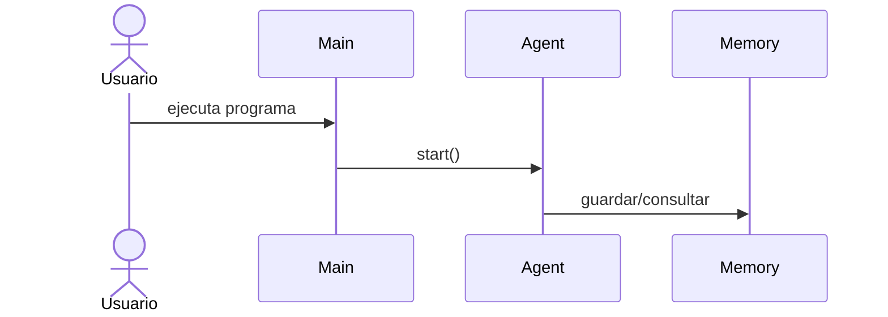

# Diagrama de comportamiento — H4


```mermaid
sequenceDiagram
    actor Usuario
    Usuario->>Main: ejecuta programa
    Main->>Agent: start()
    Agent->>Memory: guardar/consultar
```

## Flujo explicado

```text

```
