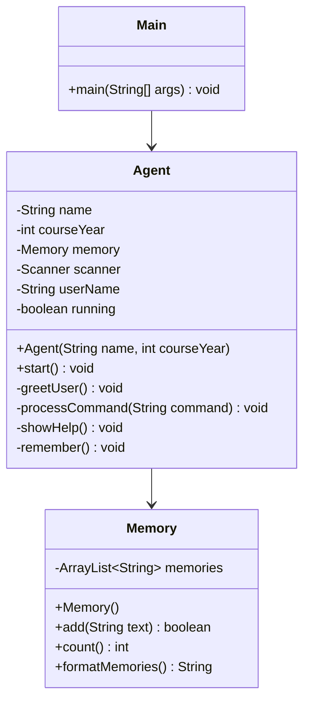

# Diagrama de clases — H4


```mermaid
classDiagram
    class Main {
      +main(String[] args) void
    }
    class Agent {
      -String name
      -int courseYear
      -Memory memory
      -Scanner scanner
      -String userName
      -boolean running
      +Agent(String name, int courseYear)
      +start() void
      -greetUser() void
      -processCommand(String command) void
      -showHelp() void
      -remember() void
    }
    class Memory {
      -ArrayList~String~ memories
      +Memory()
      +add(String text) boolean
      +count() int
      +formatMemories() String
    }
    Main --> Agent
    Agent --> Memory
```

## Explicación

```text
Main crea un Agent. Agent usa Memory para guardar y consultar recuerdos. Memory no sabe nada del menú ni de Scanner.
```
