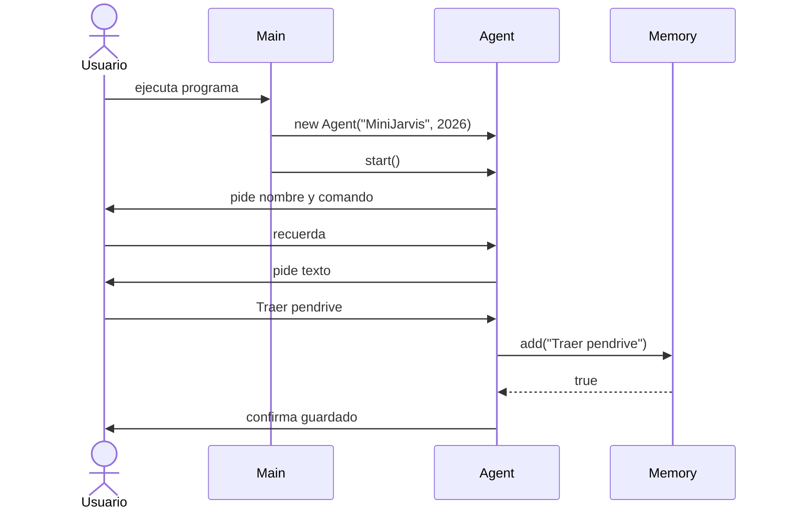

# Diagrama de comportamiento — H4



## Flujo explicado

```text
El usuario no trabaja directamente con Memory. Agent recibe comandos y delega en Memory cuando necesita guardar o mostrar recuerdos.
```
